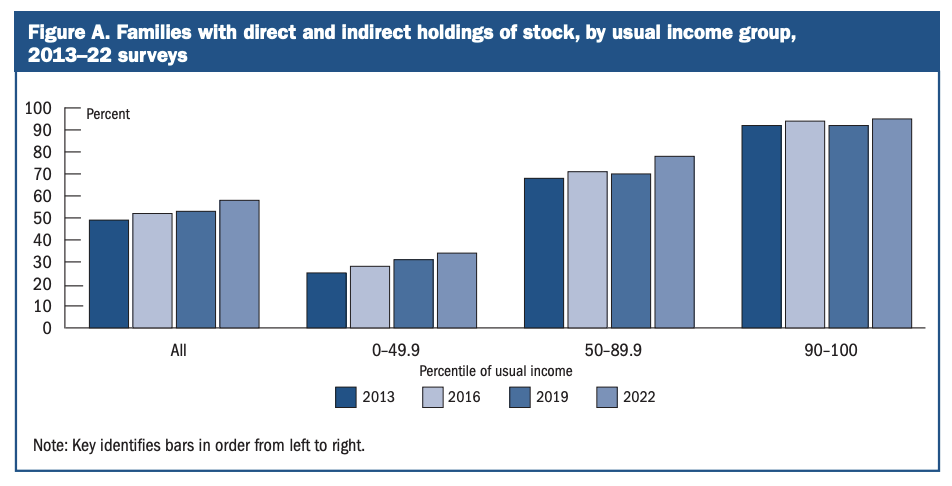

Research question, significance, and theoretical framing

Research Question: How do patterns of investment spending in the United States differ across income groups, and how might these differences affect long-term quality of life and wealth inequality trends?

Significance: Our project bridges the gap between income inequality’s present day impacts to future prospects through the lens of investment spending, consumer expenditures, and trends. 

Theoretical Framing: Our project views the differences in quality of life through the lens of data feminism, which claims that data is a non-neutral distributor of biases. We highlight the hidden narratives of the data we work with, and focus on both the surface and deeper insights on what the data indicates. 

Group member bios and role statements

Mark: Mark is a rising senior from San Francisco and is interested in business law and data. His contributions to the project include writing and being the primary researcher.  

Kelly: Kelly is a rising junior studying Environmental Economics and Data Science. In this project, Kelly focuses on the writing and on connecting the visualizations to the broader argument about income inequality and access to consumer expenditures.

Baijian: Baijian is a rising senior studying Data Science and Computer Science. He focused on preparing datasets for visualizations, and developing the project’s website using Wix.

Alica: Alica is a Data Science student interested in business analytics, inequality, and data storytelling. In this project, she works with Mark on the writing process and focuses on transparency in the data cleaning explanation, the clarity of the visualizations, and the potential distortions that can appear when inequality data is simplified.

Angela: Angela is a rising senior studying Data Science. She is collaborating with Baijian Xie on data visualization and developing the website. 

Description of dataset and data cleaning process

Description of dataset: 

Cleaning Process:
The raw BLS Excel file uses multi-row headers and merged title cells, so we loaded it with header=None and pulled the income bracket labels manually from row 2. We renamed them to shorter versions (<$15k, $15–29k, etc.) to keep the chart labels readable.

To extract spending data, we scanned column A for category names and checked whether the next two rows said "Mean" and "Share" in that order. Blocks that didn't match that structure were skipped. Cells with placeholder values like c/ (suppressed or confidential data) were also dropped rather than filled in.

We kept only the 14 top-level expenditure categories to avoid double-counting. Subcategories like "Food at home" or "Shelter" roll up into the major ones already. For each income group, we calculated an "Other" bucket as 100% minus the sum of selected categories, so the stacked bars add up to 100%. There's a small rounding gap of about ±0.5% in some groups.

We dropped the "All consumer units" column from the charts since it's an aggregate and would look out of place next to the income brackets. All values in the final charts come directly from the published BLS figures and nothing was imputed.We made these choices to keep the visualizations readable, but we also recognize that simplifying categories may hide differences within each income group.

Initial visualizations (at least 2)

Visual 1: Spending Share by Income Group

Visual 2: Investment-Related Spending Categories Across Income Groups

Draft analysis connecting data to research question (Roughly 750-1000 words)

Income inequality is deeply connected to the structure of the U.S. economy and the uneven distribution of income, assets, and investment opportunities. While the immediate impacts of income inequality can be reflected in different levels of consumer expenditure, our project focuses on the future trends caused by income inequality. Our data from the Bureau of Labor Statistics contains surveys about consumer expenditures, and surveys from the Federal Reserve are focused on investment spending. This project seeks to answer these questions: how do patterns of investment spending in the United States differ across income groups, and how might these differences affect long-term quality of life and wealth inequality trends?

Investment spending patterns aren’t immediately obvious in the data. Complexity in determining if a certain item is "investment spending” can be seen in “housing”. Housing spending can be both in spending on rent or on mortgage debt. The difference between these two in this context is that while rent is purely an expense, expenditures on mortgage payments appreciate in the form of property. Furthermore, mortgage debt payments can be expensed under US tax policy, and therefore, the impacts on both current quality of life and future prospects are significantly different between expenditure choices. The trend as followed by Visualization 2 highlights the decreasing proportion of housing spending. This shows the conceptual shift in housing as a financially dominant necessity, to an investment vehicle. This concept is additionally supported by a survey by Pew Research Center, which claims that home owners tend to be more wealthy than renters. 

Another key observation is in education spending. Education is one of the most significant financial investments for many Americans. Many families save for college, and many newly admitted students entertain the idea of student debt. The trend for education spending as shown by Visualization 2 introduces an inverse bell curve. This trend follows the idea that income varies proportionally with education. While education spending is decreasing between our lowest and median income brackets, it begins to increase between our median and highest income bracket, which indicates that wealthier households prioritize education. 

Pension and personal insurance spending highlights a noteworthy trend. The increasing proportion families spend on pensions and personal insurance underscores the significance in gains. Many companies in the world offer employee match-back policies, which is essentially additional funding toward employee retirement. The increase in pension spending is increased even further by these policies, which means that the addition of compounding interest indicates the exponential wealth gap that continues to grow between lower and higher income households. 

Events like the Great Recession and COVID 19 have intensified these trends, as highlighted in the digital humanities project The Income Gap. While financial crises spell panic for many Americans, wealthy households with large amounts of capital are benefited greatly. Investment opportunities are made more attractive with lower prices all around the board. Our government also encourages this notion, with prime interest rates changing depending on the state of the economy. This means more favorable debt and mortgage rates, and these rates carry over into the future. 

Surprisingly, entertainment continues to remain the same across households. This shows an interesting trend, where with increasing income, households continue to invest, and the proceeds of the investment are reinvested. This means that families aren’t simply spending their money, but rather, the wealth generated through investment will be placed with their children. This encourages the wealth gap, where their children may be able to live off their parent’s proceeds, and so on. 

Taking all the above into consideration with respect to racial representations in each income class can generate critical insights. Given that different income classes have disproportionate representations of races, the difference in quality of life between the income classes means even greater differences in quality of life between different racial communities. While national survey data doesn’t include races, pairing the data with other sources reveals concerning trends in the discussion of racial equality. 

Stock ownership and retirement plan participation data can be found in the Federal Reserve’s survey data. 

*Figure A.* Families with direct and indirect holdings of stock, by usual income group, 2013–22 surveys. Source: Federal Reserve Board, *Changes in U.S. Family Finances from 2019 to 2022 (Survey of Consumer Finances)*.

This chart shows the share of U.S. families that own stock (directly or through retirement accounts and funds) by income percentile. In 2022, about 34% of families in the bottom half of the income distribution held stock, compared with 78% in the 50th–89.9th percentile and 95% in the top 10%. Even as participation grew for all groups, the gap between income levels remains large — meaning many lower-income families never capture stock market gains, and the wealth gap is wider than our spending data alone suggests.

Annotated Bibliography (Due Thursday, June 25 with First Draft)

Compile 5-7 sources including: 

web:https://incomeinvestment.wixsite.com/incomeandinvestment

2-3 relevant DH projects for comparison
DH Project:

https://theincomegap.humspace.ucla.edu/about/
Relevance & Visibility: This project analyzes how U.S. household wealth differs across demographic groups and how crises such as the Great Recession and COVID-19 have widened these gaps. We use the U.S. Consumer Expenditure Survey to study investment-related behavior, focusing on categories like mortgage payments across income classes, while the Income Gap project complements this by showing longer-term wealth outcomes. The Income Gap project presents inequality through interactive charts, maps, and a timeline that places data in historical context. We might follow a similar approach by pairing CEX spending patterns to explain how financial flows connect to wealth. 

“Nine Charts about Wealth Inequality in America” – Urban Institute
https://apps.urban.org/features/wealth-inequality-charts/
Relevance & Visibility: This is an interactive web feature that uses charts and narrative text to explain how wealth inequality has changed over roughly the last 60 years and how it varies by demographic factors, including race and age. It also explains “what’s driving inequities” and how policy choices can help close wealth gaps, which aligns with our interest in connecting consumer expenditure behavior to broader structural patterns in society. This is a model for turning complex distribution data into accessible visuals with guided interpretation, which is what our group wanted ot learn from and do with the CEX data. We will reference it as a comparison point for our design choices when designing our website. The structure of each chart is introduced by a short explanation and followed by a key takeaway, which informs how we plan the layout and captions on our own site, especially for the bar charts and time series that compare spending across income groups. The project’s explicit discussion of drivers and policy implications in the end encourages us to end our analysis sections with short reflections on what our spending gaps might mean for inequality and what kinds of interventions could matter, which is a step beyond only data interpretation.

“The Unequal States of America” – Economic Policy Institute
https://www.epi.org/multimedia/unequal-states-of-america/#/United%20States
This is an interactive website that lets users explore income inequality by state, county, and metro area in the United States. It uses the ratio of the top 1% income to the bottom 99%, based on the report “The New Gilded Age”. It highlights specific benchmarks, such as the minimum income to be in the top 1%, to make inequality feel concrete. This DH project is a great example for us, as it covers inequality data presented with detailed filters and hover interactions. Although our filter group of analysis is the income group instead of the state, the EPI interface suggests ways we can let users switch easily between brackets, including bottom, middle, and top income groups, and see how spending changes across those categories. Moreover, the project’s focus on making inequality legible to non-expert audiences is a reminder to us that our visual and writing choices should prioritize clarity and accessibility, so that audiences can quickly understand the intention of the project.

2-3 theoretical readings that inform your approach
Theoretical readings:

https://dhq.digitalhumanities.org/vol/12/4/000408/000408.html
Hepworth and Church argue for the careful consideration of how visualizations can distort history or current events. This can be done unintentionally, as in an effort to draw attention to one cause, a project can potentially communicate the false notion that it is the only issue at hand. They outline an ethical workflow, from defining and collecting data to visualizing and publishing, meant to minimize harm while maintaining explanatory power. The visibility of this source in our project is in our whole processing section, i.e., when we decide how to aggregate income brackets, and which variables to highlight, we need to explicitly consider whose circumstances might be underrepresented or misrepresented. All our design choices, like axis scales, baselines, the number of groups, and others, could change how large or small the gaps between income groups appear. Hepworth and Church’s focus on ethical data visualizations pushes us to prioritize clean and clear visualizations.

D’Ignazio, Catherine, and Lauren F. Klein. Data Feminism. MIT Press, 2020.
D’Ignazio and Klein argue that data science is informed by intersectional feminism and that researchers should pay attention to what gets left out and how structural forces like racism and sexism shape those choices. This matters for our project, as Consumer Expenditure Data and Survey of Consumer Finances do not just reflect expenditure behavior, but also organize financial life into categories that already make some experiences visible and others harder to see. In the process of our project, the framework shows up in the way we define and clean our data. We have to make choices on how we want the story our visualizations tell. Data Feminism makes us be more transparent about missing and limited data, including those that are not fully captured in the available tables or show up in the survey data. Thus, in the final website, we would like to explain our method and filtering process clearly, to avoid presenting the charts as if they were objective truths.

1-2 sources about your dataset or topic
Federal Reserve Board. (2023). Changes in U.S. family finances from 2019 to 2022: Evidence from the Survey of Consumer Finances. https://www.federalreserve.gov/publications/files/scf23.pdf

U.S. Bureau of Labor Statistics. (2025). Consumer Expenditure Surveys: Income before taxes: Average annual expenditures and characteristics, Consumer Expenditure Surveys, 2024 [Data set]. https://www.bls.gov/cex/tables/calendar-year/mean-item-share-average-standard-error/cu-income-before-taxes-2024.xlsx

Pew Research Center. (2021, August 2). As national eviction ban expires, a look at who rents and who owns in the U.S. https://www.pewresearch.org/short-reads/2021/08/02/as-national-eviction-ban-expires-a-look-at-who-rents-and-who-owns-in-the-u-s/
Bureau of Labor Statistics. (n.d.). Education pays, 2024. U.S. Department of Labor. https://www.bls.gov/emp/chart-unemployment-earnings-education.htm
Miller, S. (2020, June 26). Black workers still earn less than their white counterparts. SHRM. https://www.shrm.org/topics-tools/news/benefits-compensation/black-workers-still-earn-less-white-counterparts

Write 2-3 sentences per source explaining its relevance + 3-4 sentences explaining its visibility in the process of the project

Peer Review Workshop: Groups will exchange projects and provide structured feedback by Monday, June 29th. The feedback should be 100-200 words from each group member on different individual components of the project, such as: About Page, Narrative, Visualizations, Data / Transparency, Sources Used, and / or general user interface and design.

